# ChatVote — Architecture Map

> Auto-generated architecture documentation. See `CLAUDE.md` for dev commands.

---

## 1. High-Level System Overview

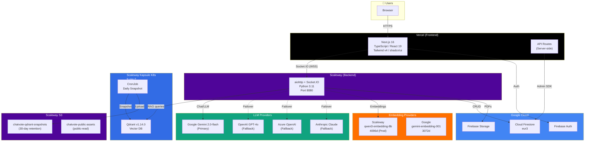

---

## 2. Production Endpoints

| Service | Location | Protocol |
|---------|----------|----------|
| **Frontend** | Vercel (custom domain) | HTTPS |
| **Backend API** | Scaleway Serverless Container | HTTPS |
| **Qdrant (K8s LB)** | K8s LoadBalancer `:6333` | HTTP |
| **Qdrant (internal)** | K8s ClusterIP `:6333` | HTTP |
| **Docker Registry** | Scaleway Container Registry (private) | HTTPS |
| **S3 Snapshots** | Scaleway Object Storage (30-day retention) | HTTPS |
| **S3 Assets** | Scaleway Object Storage (public-read) | HTTPS |
| **Logs** | Scaleway Cockpit (Loki) | HTTPS |
| **Firebase** | Google Cloud Firestore (`eur3` region) | — |

### Local Development Ports

| Service | Port |
|---------|------|
| Frontend (Turbopack) | `localhost:3000` |
| Backend (aiohttp) | `localhost:8080` |
| Qdrant HTTP | `localhost:6333` |
| Qdrant gRPC | `localhost:6334` |
| Firestore Emulator | `localhost:8081` |
| Auth Emulator | `localhost:9099` |
| Firebase UI | `localhost:4000` |
| Ollama | `localhost:11434` |

---

## 3. Real-Time Communication Flow

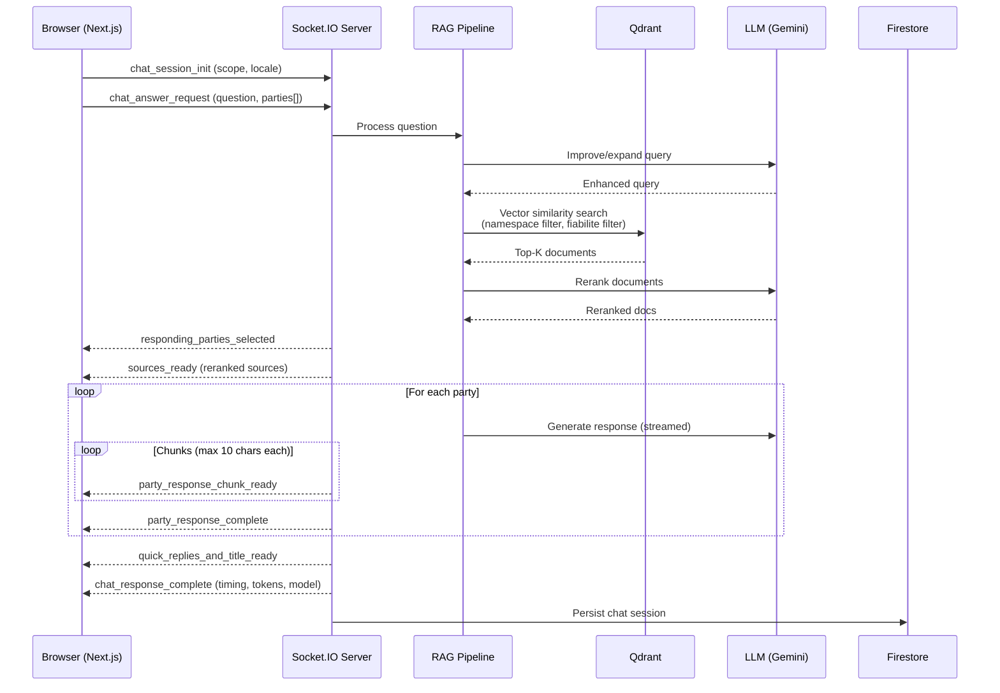

### Socket.IO Events Reference

| Direction | Event | Purpose |
|-----------|-------|---------|
| **C→S** | `chat_session_init` | Initialize chat (scope, user locale) |
| **C→S** | `chat_answer_request` | User question + party/candidate selection |
| **C→S** | `pro_con_perspective_request` | Pro/con analysis for a party |
| **C→S** | `candidate_pro_con_perspective_request` | Pro/con for a candidate |
| **C→S** | `voting_behavior_request` | Parliamentary voting summary |
| **S→C** | `responding_parties_selected` | Confirms selected parties |
| **S→C** | `sources_ready` | RAG-retrieved sources (reranked) |
| **S→C** | `party_response_chunk_ready` | Streamed response chunk |
| **S→C** | `party_response_complete` | Single party response done |
| **S→C** | `quick_replies_and_title_ready` | Title + follow-up suggestions |
| **S→C** | `chat_response_complete` | Final metadata (time, tokens, model) |
| **S→C** | `stream_reset` | Reset frontend stream (LLM failure recovery) |
| **S→C** | `debug_llm_call` | Debug info (dev only) |

---

## 4. Backend Architecture

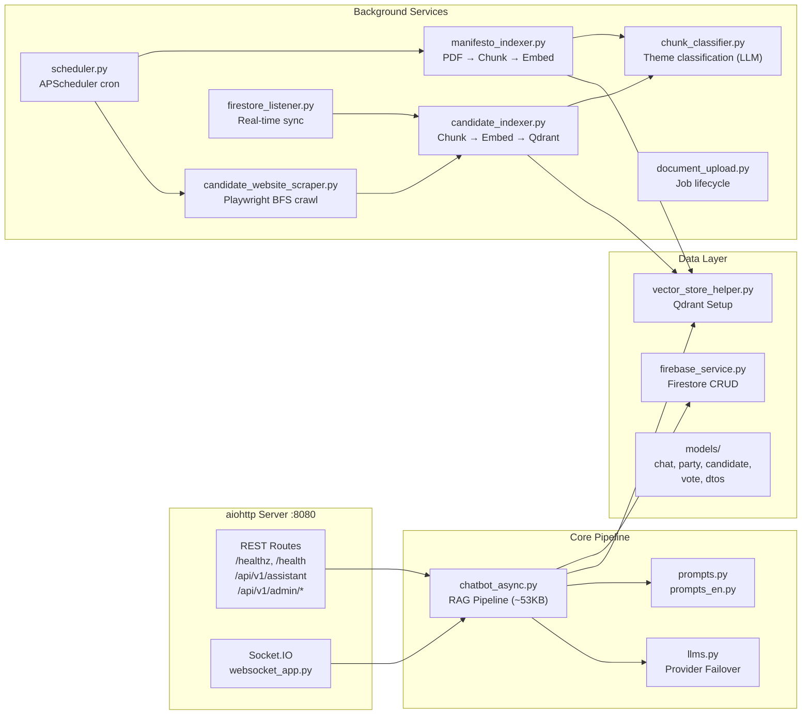

### LLM Provider Failover Chain

```mermaid
graph LR
    Q["User Query"] --> G["Gemini 2.0-flash<br/>🟢 Primary"]
    G -.->|"Rate limit / error"| O1["GPT-4o<br/>🟡 Fallback 1"]
    O1 -.-> O2["GPT-4o-mini<br/>🟡 Fallback 2"]
    O2 -.-> A1["Azure GPT-4o<br/>🟠 Fallback 3"]
    A1 -.-> A2["Azure GPT-4o-mini<br/>🟠 Fallback 4"]
    A2 -.-> C1["Claude 3.5 Sonnet<br/>🔵 Fallback 5"]
    C1 -.-> C2["Claude 3 Haiku<br/>🔵 Fallback 6"]
    C2 -.-> L["Ollama llama3.2<br/>⚪ Dev only"]

    style G fill:#34a853,color:#fff
    style O1 fill:#f9ab00,color:#000
    style O2 fill:#f9ab00,color:#000
    style A1 fill:#ff6f00,color:#fff
    style A2 fill:#ff6f00,color:#fff
    style C1 fill:#6366f1,color:#fff
    style C2 fill:#6366f1,color:#fff
    style L fill:#666,color:#fff
```

### Embedding Providers

| Provider | Model | Dimensions | Environment |
|----------|-------|-----------|-------------|
| Scaleway | `qwen3-embedding-8b` | 4096 | **Production** |
| Google | `gemini-embedding-001` | 3072 | Fallback |
| OpenAI | `text-embedding-3-large` | 3072 | Fallback |
| Ollama | `nomic-embed-text` | 768 | Local dev |

---

## 5. Qdrant Vector Collections

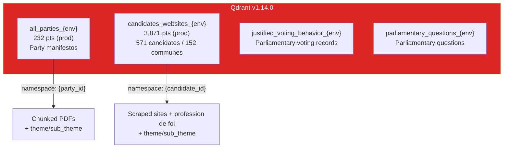

**Metadata schema:** `party_ids` (KEYWORD), `candidate_ids` (KEYWORD), `theme` (KEYWORD), `sub_theme` (KEYWORD), `fiabilite` (INTEGER, 0–3)

---

## 6. Frontend Architecture

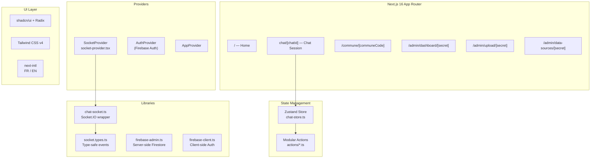

---

## 7. Kubernetes Infrastructure

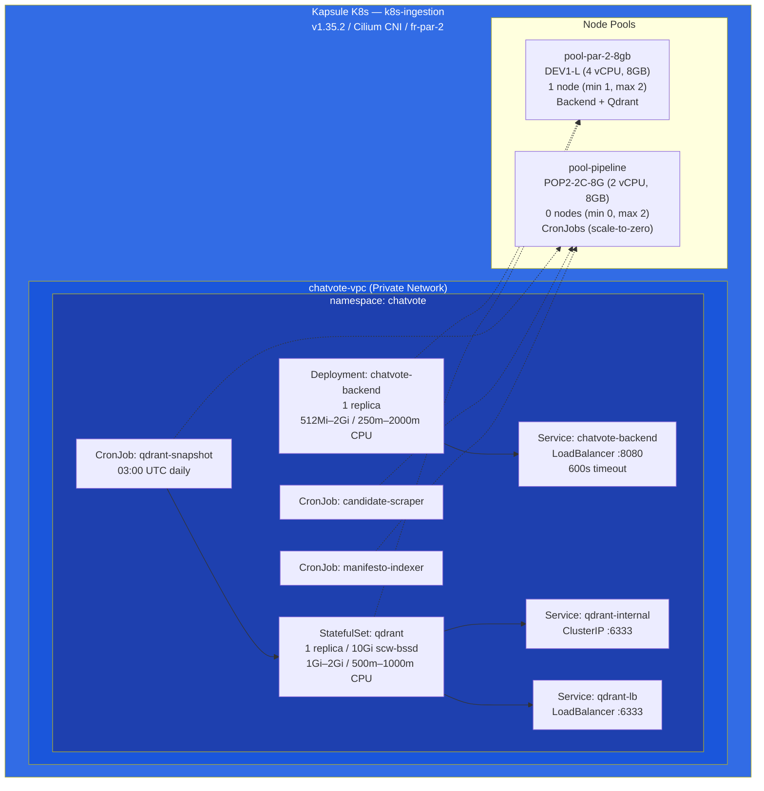

### Health Probes

| Probe | Endpoint | Interval | Threshold |
|-------|----------|----------|-----------|
| Backend startup | `/healthz` | 5s | 30 failures (150s max) |
| Backend liveness | `/healthz` | 15s | 3 failures → kill |
| Backend readiness | `/health` (deep) | 10s | 3 failures → remove from LB |

---

## 8. CI/CD Pipelines

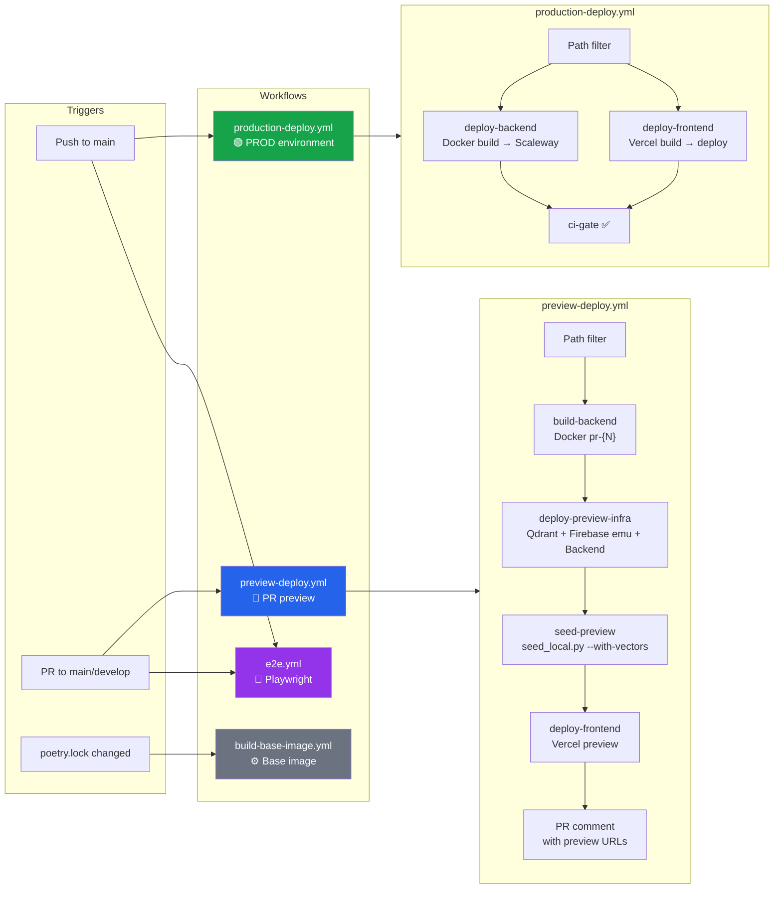

### Production Deploy Flow

1. Push to `main` → GitHub Actions triggers `production-deploy.yml` (env: `PROD`)
2. **Path filter**: detect backend (`CHATVOTE-BackEnd/**`) vs frontend (`CHATVOTE-FrontEnd/**`) changes
3. **Backend**: Docker build → push to Scaleway registry → create/update serverless container (4096MB, 2240mCPU, min 1 / max 3) → poll `/healthz` up to 10 min
4. **Frontend**: `vercel pull` → sync env vars → `vercel build --prod` → `vercel deploy --prebuilt --prod`
5. **CI gate**: verify both succeeded or were skipped

### Preview Deploy Flow (per PR)

Deploys ephemeral infra: `backend-pr-{N}` + `qdrant-pr-{N}` + `firestore-pr-{N}` + `auth-pr-{N}` on Scaleway (scale-to-zero). Seeds data, deploys Vercel preview, posts URLs as PR comment. Auto-cleaned on PR close.

---

## 9. Infrastructure as Code (OpenTofu)

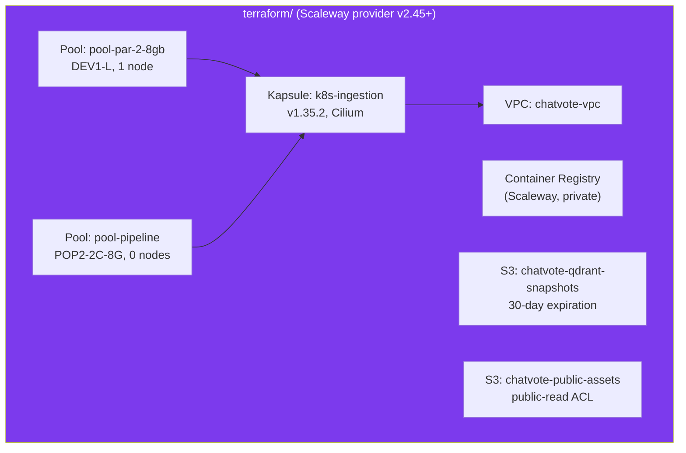

> **Note:** The Scaleway serverless container `backend-prod` is intentionally **not** managed by Terraform — it's owned by CI/CD (`production-deploy.yml`) to avoid conflicts.

---

## 10. Data Flow: Ingestion Pipeline

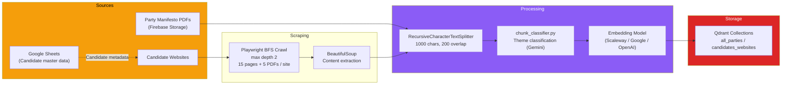

---

## 11. Authentication & Security

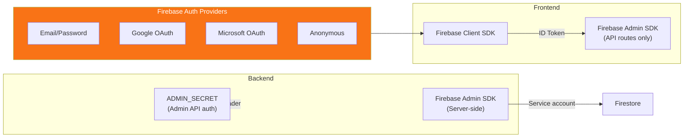

---

## 12. Firebase Data Model

| Collection | Purpose | Key Fields |
|------------|---------|------------|
| `chat_sessions` | Conversation history | `user_id`, `updated_at`, `created_at`, `messages[]` |
| `parties` | Political party metadata | `name`, `logo`, `manifesto_url` |
| `candidates` | Candidate metadata | `name`, `party_id`, `commune`, `website` |
| `municipalities` | French commune data | `code`, `name`, `department` |
| `cached_answers` | Pre-computed answers | `question_hash`, `party_id`, `response` |
| `proposed_questions` | Suggested follow-ups | `party_id`, `questions[]` |
| `system_status` | LLM rate limit tracking | `llm_status` subdoc |

**Indexes:** Composite on `chat_sessions` (`user_id` + `updated_at` + `created_at`)

---

## 13. Docker Images

| Image | Tag | Purpose | Size |
|-------|-----|---------|------|
| `backend` | `:{sha}`, `:latest` | Production backend | ~258MB |
| `backend-base` | `:latest` | Cached deps + Playwright/Chromium | Larger |
| `backend` | `:pr-{N}` | Preview backend | ~258MB |
| `firebase-emulator` | `:latest` | Firebase emulator suite | — |
| `qdrant-snapshot` | `:latest` | Daily snapshot to S3 | — |
| `qdrant/qdrant` (public) | `:v1.14.0` | Vector database | — |

> All custom images are stored in a private Scaleway Container Registry.

---

## 14. Key Files Reference

| Category | File | Purpose |
|----------|------|---------|
| **CI/CD** | `.github/workflows/production-deploy.yml` | Prod deploy (main push) |
| | `.github/workflows/preview-deploy.yml` | PR preview environments |
| | `.github/workflows/build-base-image.yml` | Base Docker image rebuild |
| | `.github/workflows/e2e.yml` | Playwright E2E tests |
| **Backend** | `CHATVOTE-BackEnd/src/aiohttp_app.py` | HTTP server + REST routes |
| | `src/websocket_app.py` | Socket.IO event handlers |
| | `src/chatbot_async.py` | Core RAG pipeline (~53KB) |
| | `src/llms.py` | LLM provider failover |
| | `src/vector_store_helper.py` | Qdrant setup |
| | `src/firebase_service.py` | Firestore CRUD |
| | `src/services/candidate_website_scraper.py` | Playwright BFS crawler |
| | `src/services/candidate_indexer.py` | Candidate → Qdrant |
| | `src/services/manifesto_indexer.py` | Manifesto → Qdrant |
| **Frontend** | `CHATVOTE-FrontEnd/src/lib/chat-socket.ts` | Socket.IO client wrapper |
| | `src/lib/stores/chat-store.ts` | Zustand state |
| | `src/lib/firebase-admin.ts` | Server-side Firestore |
| | `src/lib/firebase-client.ts` | Client-side Auth |
| | `src/lib/socket.types.ts` | Type-safe Socket.IO events |
| **K8s** | `k8s/deployment.yaml` | Backend pod |
| | `k8s/qdrant-statefulset.yaml` | Qdrant persistent state |
| | `k8s/service.yaml` | Backend LoadBalancer |
| | `k8s/cronjob-qdrant-snapshot.yaml` | Daily backup |
| **IaC** | `terraform/scaleway.tf` | Scaleway infra (VPC, K8s, S3) |
| **Build** | `Makefile` | Dev automation |
| | `CHATVOTE-BackEnd/Dockerfile` | Prod image |
| | `CHATVOTE-BackEnd/Dockerfile.base` | Cached deps layer |
| | `CHATVOTE-BackEnd/docker-compose.dev.yml` | Local dev services |
